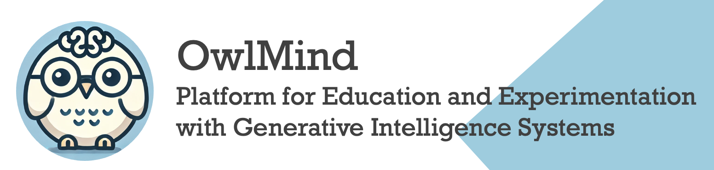
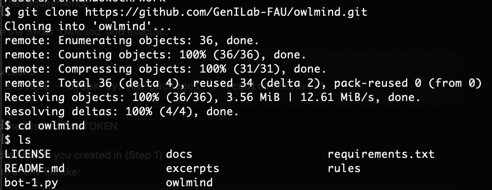
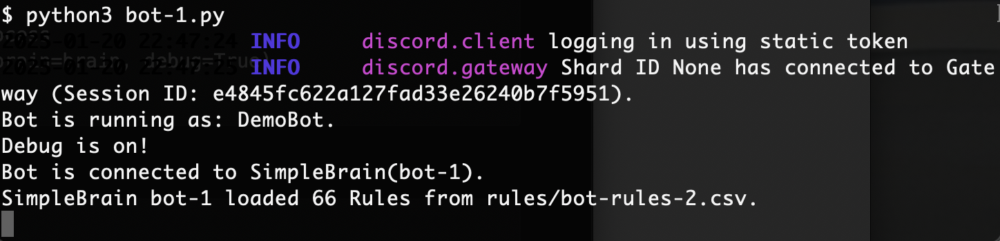
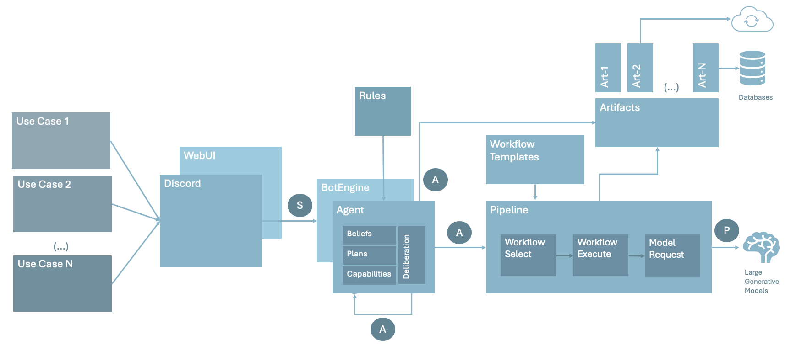

<center>


### [Get Started](#getting-started) | [Understand](#understanding) | Extend | Contribute
</center>

# OwlMind 

OwlMind is a DIY Education Experimentation Platform being created by The Generative Intelligence Lab, at Florida Atlantic University. The focus is on education, helping students to get quick results whle implementing consumable GenAI-based Agentic System.


## Getting Started

During this process you will:

1. Configure your Discord Bot 
2. Install OwlMind locally
3. Animate your Discord Bot with an OwlMind BotBrain
4. Customize your OwlMind BotBrain

Note: To follow this step you must have PYTHON3, PIP3 and GIT installed locally.

[How to install PYTHON and PIP?](https://packaging.python.org/en/latest/tutorials/installing-packages/)

[How to install GIT?](https://github.com/git-guides/install-git)


### (Step 1) Configure your Discord Bot 

Follow the instructions at: [How-to Configure a Discord Bot with Owlmind?](docs/discord.md)

* **Save the TOKEN** that you created thought this process; we will use it in Step 
* **Provide the URL to the Discord Server admin** for adding to the server. 
* Notice that **the Bot will be offline**  until you connect to the Bot Runner (next).

### (Step 2) Install OwlMind locally

(2.a) Clone the source from GitHub:

```
$ git clone https://github.com/GenILab-FAU/owlmind.git
```




### 3. Animate your Discord Bot with an OwlMind BotBrain

(3.a) Install the requirements:

Move inside the folder 'owlmind' and execute:

[How to install PYTHON and PIP?](https://packaging.python.org/en/latest/tutorials/installing-packages/)


```
$ cd owlmind
$ pip3 install --break-system-packages -r requirements.txt
```

Alternative:

```
$ python3 -m pip install --break-system-packages -r requirements.txt
```

(3.b) Setup the Discord Bot TOKEN
* Get the TOKEN you created in (Step 1)
* Create the file .env inside fodler 'owlmind':
```
# FILE :: .env
TOKEN={My Token}
```

Alternatively, you can hard-code the TOKEN within bot-1.py

```
# FILE :: bot-1.py

(...)
if __name__ == '__main__':
    (...)

    ## Alternative: Hard-code your TOKEN here and remote the comment:
    # TOKEN={My Token} 

    (...)
    # Kick start the Bot Runner process
    bot = DiscordBot(token=TOKEN, brain=brain, debug=True)
    bot.run()
```


(3.c) Execute the 'getting started' BotMind:

```
$ python3 bot-1.py
```

It should startup like this:



At this point your Bot should be animated (check on Discord!)


## Understanding



OwlMind provides the base to create Rule-Based Agents that will be connected to diverse elements (see Fig. 1):
* Bot Runner for Discord Bots
* Agentic Core to configure Rule-based systems.
* Configurable GenAI Pipelines.
* Extension to configure Workflow Templates to be applied during Prompt Augmentation proccess. 
* Extension to configure Artifacts to external functionally, such as Functions, Databases, RAG systems, Web Apps, Frameworks, Controllers, and others.


### What should I be configuring?

* (NO-CODE) [Configure SimpleMind Rules](docs/simplemind.md)


